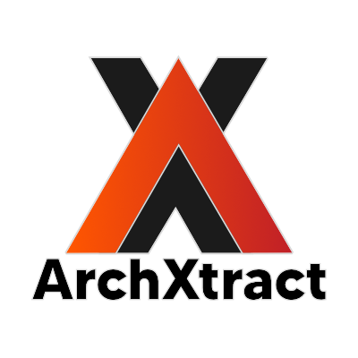

# ArchXtract


ArchXtract is a powerful Python tool designed to automate the extraction and management of various archive file formats. It supports `.7z`, `.zip`, `.rar`, `.gz`, and `.tar` files, making it a versatile solution for handling compressed data. The tool can also be configured to delete extracted archives, as well as other specified file types, after extraction.

## Features

- **Multi-format Support**: Extracts `.7z`, `.zip`, `.rar`, `.gz`, and `.tar` archives.
- **Concurrent Processing**: Utilizes a thread pool for efficient multi-threaded extraction.
- **Configurable**: Settings managed through a `config.yaml` file.
- **Automated Cleanup**: Optional deletion of extracted files and other specified file types.

---

## Dependencies
`py7zr`
`zipfile`
`rarfile`
`gzip`
`tarfile`
`yaml`

#### Install dependencies using:
`pip install py7zr rarfile pyyaml`

---

## Usage

1. **Configure Settings**: Edit the `config.yaml` file to specify which archive types to extract and whether to delete files post-extraction.
2. **Run the Script**: Execute `ArchXtract-Beta.py` and select the folder containing your archive files.
3. **Extraction and Cleanup**: The script will extract all supported archives and optionally delete them based on your configuration.

---

## Configuration

The `config.yaml` file should include the following settings:

```yaml
extract_7z_archives: true
extract_zip_archives: true
extract_rar_archives: true
extract_gz_archives: true
extract_tar_archives: true

delete_7z_archives: false
delete_zip_archives: false
delete_rar_archives: false
delete_gz_archives: false
delete_tar_archives: false
delete_txt_files: false

max_workers: 5
```


---
## Always Looking To Improve

**Have Suggestions?**
Please feel free to open an issue - and I would be happy to hear you out and see what we can make happen, even if you don't want to commit code directly.

**Why Contribute?**
ArchXtract is a side project that I am passionate about, and it has the potential to benefit the emulation community. However, as a solo developer, I face limitations in terms of time and expertise. By contributing to ArchXtract, you can help:

* Improve the tool's functionality and performance
* Add support for more game formats and systems
* Enhance the user experience
* Share your knowledge and expertise with the community

**Contributing Guidelines**
If you're interested in contributing, please:

* Fork the repository
* Create a new branch for your feature or fix
* Submit a pull request with a clear description of your changes

>**Thank You**
I appreciate your interest in ArchXtract and look forward to collaborating with you to make this tool a valuable resource for the emulation community. - *B1GBOOM*

---

## License
This project is licensed under the MIT License.
